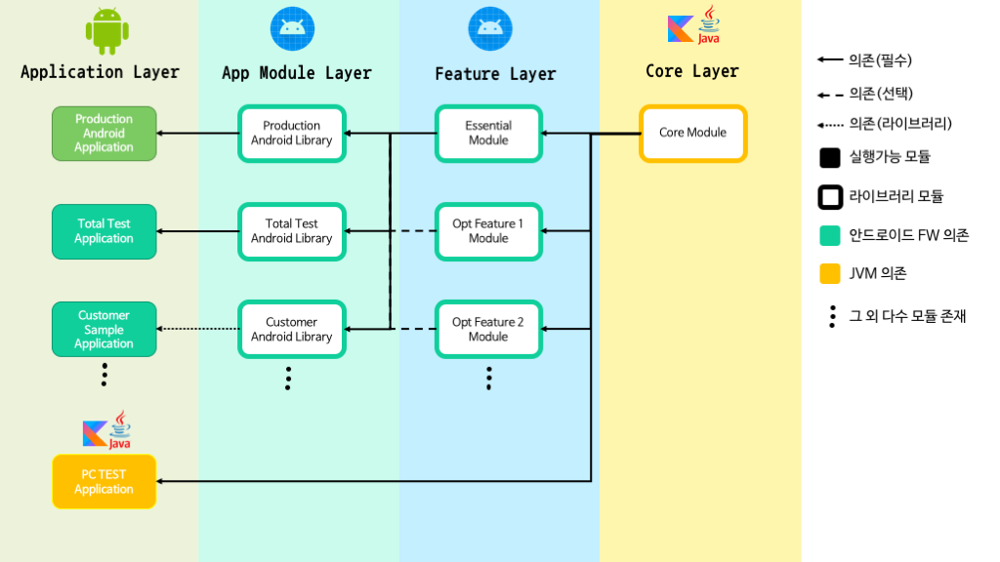
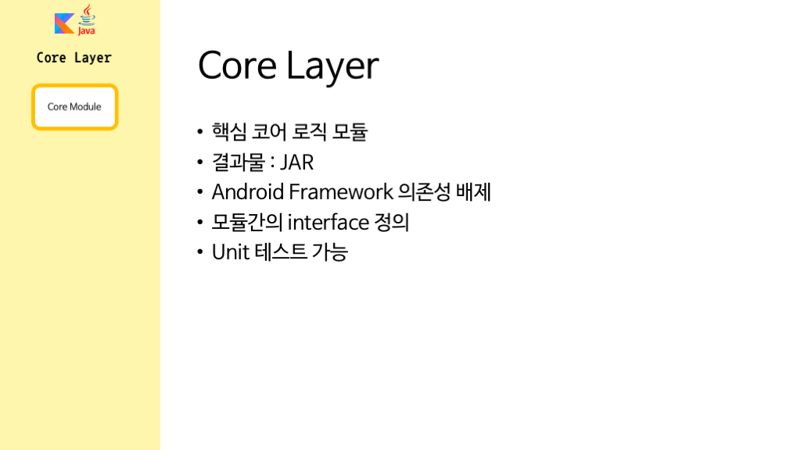
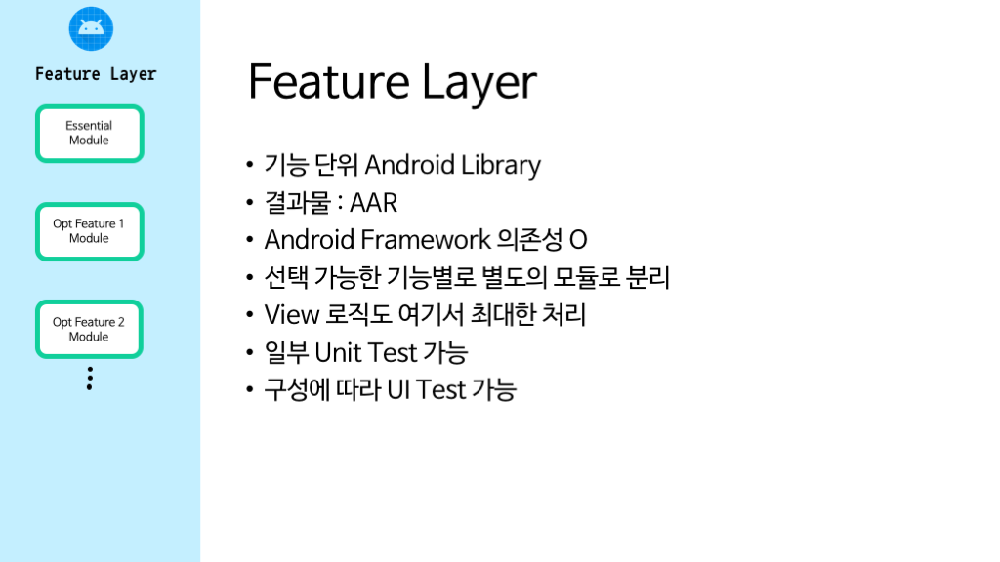
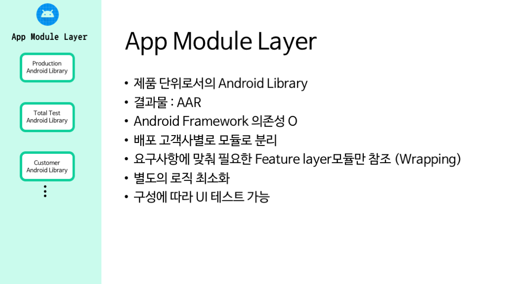
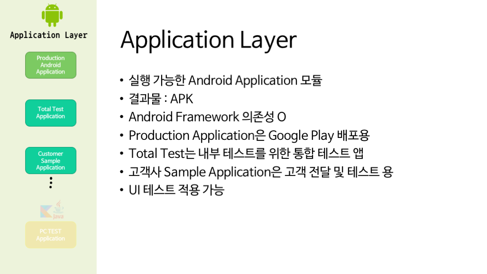
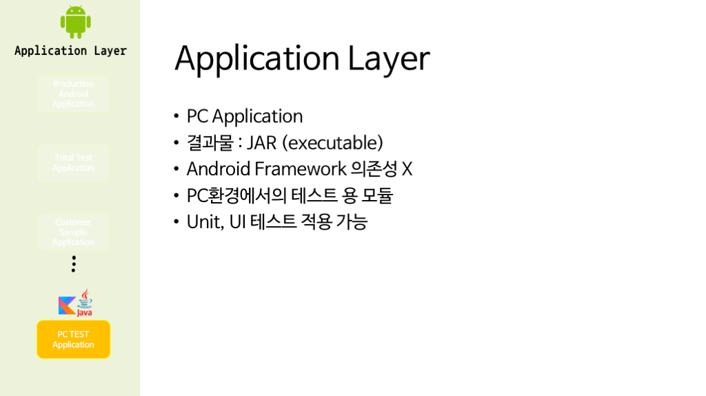

Android-Multi-Module-Sample
===========================================

➗ Android Multi-Module Sample Project. 

# Purpose

- 하나의 핵심 로직을 가지고 여러개의 상용 앱 및 상용 안드로이드 라이브러리르 배포, 관리해야 하는 경우를 위한 안드로이드 멀티모듈 샘플 프로젝트 입니다. 
- 하나의 프로젝트로 다음을 모두 배포/관리 할 수 있습니다. 
  - Google Play 배포용/테스트용 Android Application
  - Android Library (AAR)
  - Android Library의 Sample Android Application
  - PC용 Executable JAR Application

# Structure

## 전체 모듈간 구성도 
****
- Application Layer는 실제 실행 가능한 어플리케이션(APK) 
- App Module Layer는 배포 가능한 안드로이드 라이브러리(AAR)
- Feature Layer는 선택적 사용할 기능단위 안드로이드 라이브러리(AAR)
- Core Layer는 핵심 로직과 전체적인 Interface (JAR)

****
- Core Layer는 의도적으로 Android Framework 의존성을 배제하여 Test가능한 구조.

****
- 기능단위로 선택 가능하게 끔 Android Library를 구성
- 가능한 한 View로직을 여기서 처리

****
- Feature Module을 선택적으로 Wrapping만 하여 고객사에 배포를 목적으로 하는 Android Library 

****
- Google Play에 직접 배포할 상용앱, 또는 Feature Module을 테스트 할 테스트 앱, 그리고 마지막으로 고객사 등에 전달할 샘플용 앱 세가지 종류의 실행가능한 Android 앱을 구성하는 Layer.
- 로직을 최소화 하지 않으면 App Module Layer와 Application Layer 모두에 로직이 나뉘어 목적을 잃어버릴 수 있으므로 주의해야 한다.

****
- 특수한 경우로 PC환경에서 테스트를 필요로 하면 Core Module을 참조하고, 필요에 따라 UI (JavaFX, Swing 등) 프레임워크를 붙여서 PC에서 테스트 가능한 어플리케이션도 구성 가능하다.


# Sample Run
- Production App 은 Feature1만 갖는다.
- Total Test App 은 Feature1, Feature2를 모두 갖는다.
- Customer App 은 Feature2만 갖는다.
- PC Test App은 gradle task/jar 로 executable JAR 를 생성할 수 있다.
- 추가 예정...

# Licence
```
MIT License

Copyright (c) 2019 Haenala Shin

Permission is hereby granted, free of charge, to any person obtaining a copy
of this software and associated documentation files (the "Software"), to deal
in the Software without restriction, including without limitation the rights
to use, copy, modify, merge, publish, distribute, sublicense, and/or sell
copies of the Software, and to permit persons to whom the Software is
furnished to do so, subject to the following conditions:

The above copyright notice and this permission notice shall be included in all
copies or substantial portions of the Software.

THE SOFTWARE IS PROVIDED "AS IS", WITHOUT WARRANTY OF ANY KIND, EXPRESS OR
IMPLIED, INCLUDING BUT NOT LIMITED TO THE WARRANTIES OF MERCHANTABILITY,
FITNESS FOR A PARTICULAR PURPOSE AND NONINFRINGEMENT. IN NO EVENT SHALL THE
AUTHORS OR COPYRIGHT HOLDERS BE LIABLE FOR ANY CLAIM, DAMAGES OR OTHER
LIABILITY, WHETHER IN AN ACTION OF CONTRACT, TORT OR OTHERWISE, ARISING FROM,
OUT OF OR IN CONNECTION WITH THE SOFTWARE OR THE USE OR OTHER DEALINGS IN THE
SOFTWARE.
```
